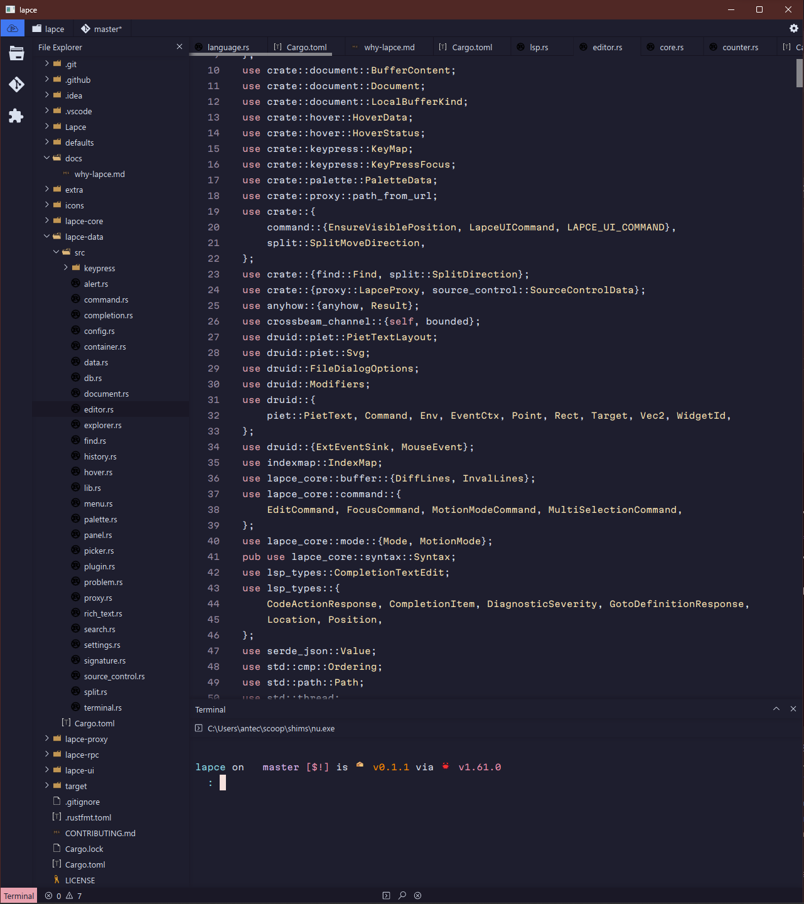

# Catppuccin 😸 (this is old theme)

## Installation

- copy `catppuccin.toml` to themes folder in your Lapce config.
  - On Linux/MacOS: `~/.config/Lapce/themes/`
  - On Windows: `%APPDATA%\Lapce\themes\`

- Go to `Settings` -> `Color Theme` -> type `catppuccin` -> reload Editor

## Misc

this is my first editor theme, so submit issue if you find any bug.
For more awesome themes for other things like Terminal, go to [Catppuccin](https://github.com/catppuccin/catppuccin)

