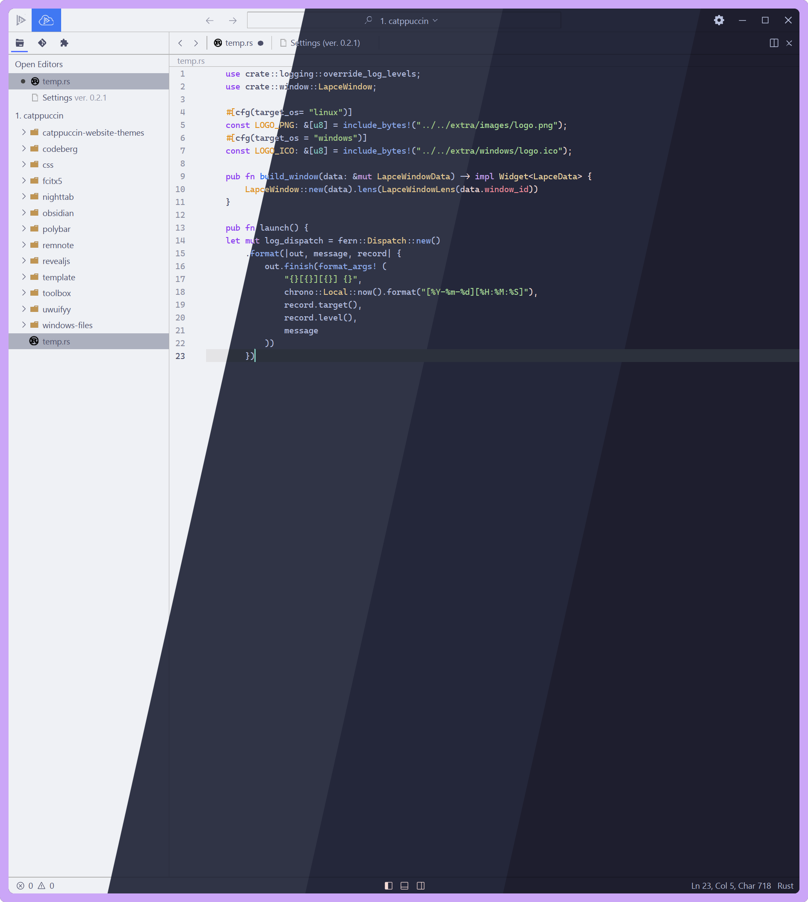
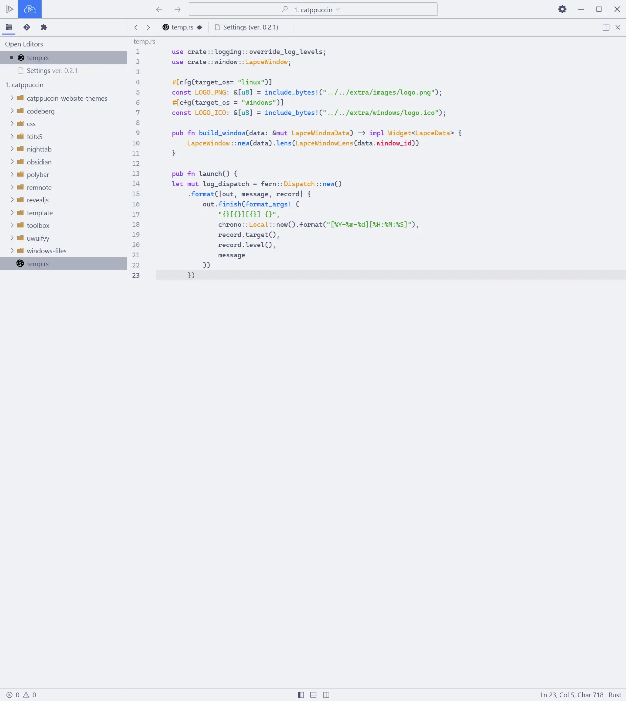
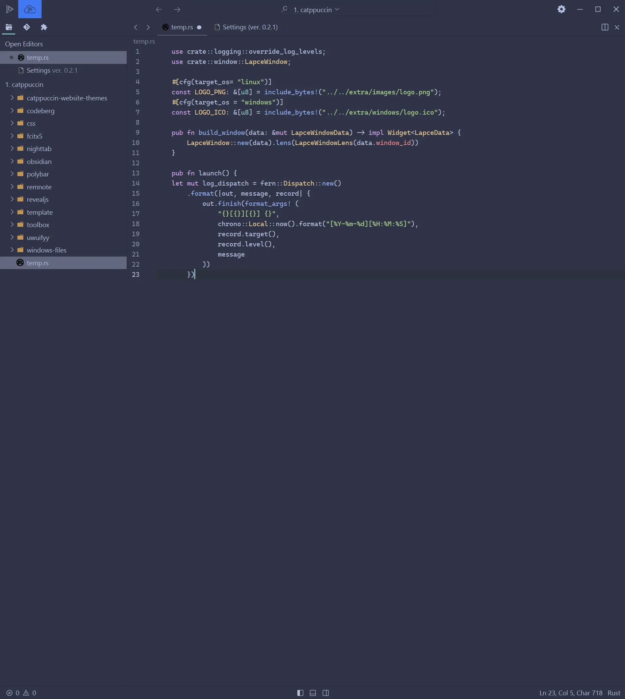
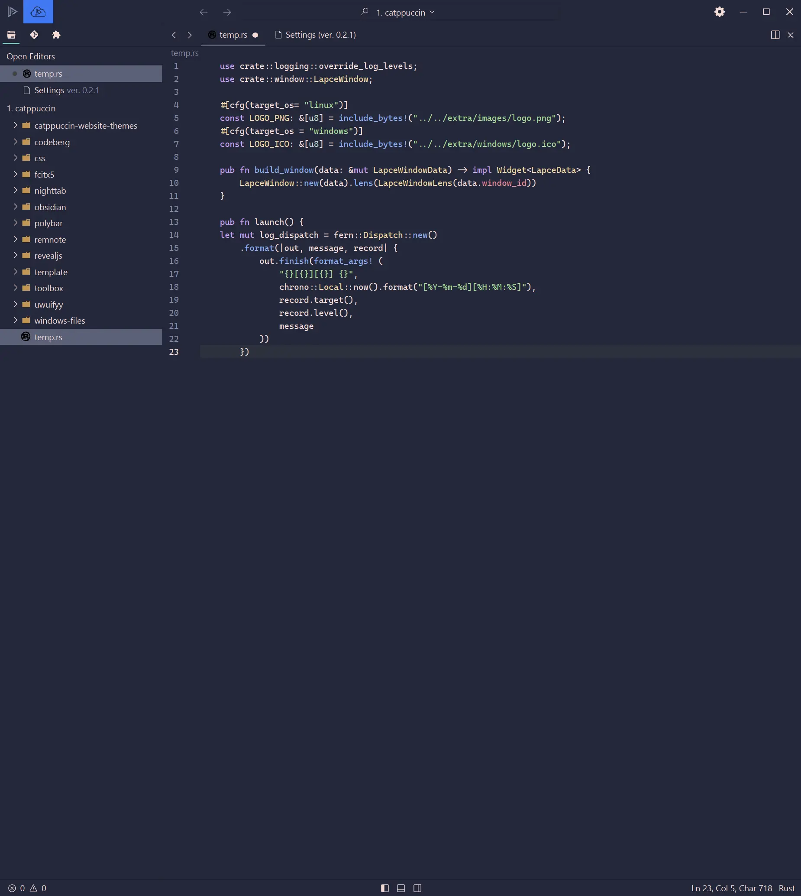
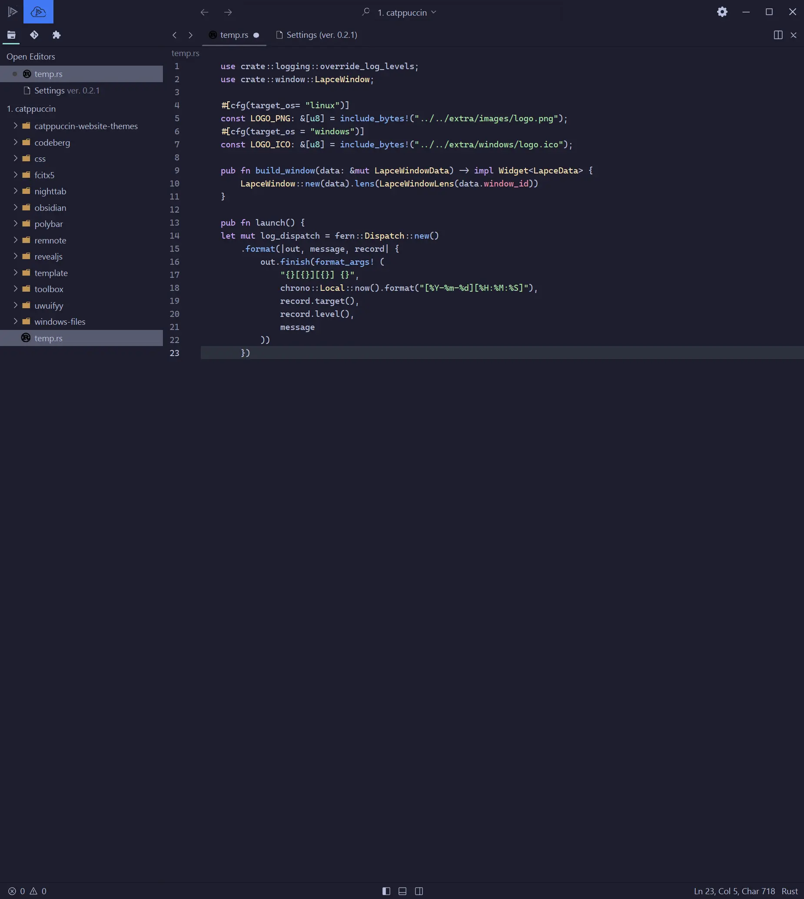

<h3 align="center">
	 
	
	Catppuccin for <a href="https://github.com/lapce/lapce">Lapce</a>
	
</h3>

	
	
	

	

## Previews

🌻 Latte

🪴 Frappé

🌺 Macchiato

🌿 Mocha

## Usage

1. Open Lapce
2. Go to Plugins
3. Scroll down to Catppuccin -> Install
4. Open Settings -> Change Theme
5. Type in `Catppuccin [Flavour]`

## 💝 Thanks to

- [tuxinal](https://github.com/tuxinal)
- [ghishadow](https://github.com/ghishadow)
- [winston](https://github.com/nekowinston)
- [justTOBBI](https://github.com/justTOBBI)

&nbsp;

	

	Copyright &copy; 2021-present <a href="https://github.com/catppuccin" target="_blank">Catppuccin Org</a>

	

